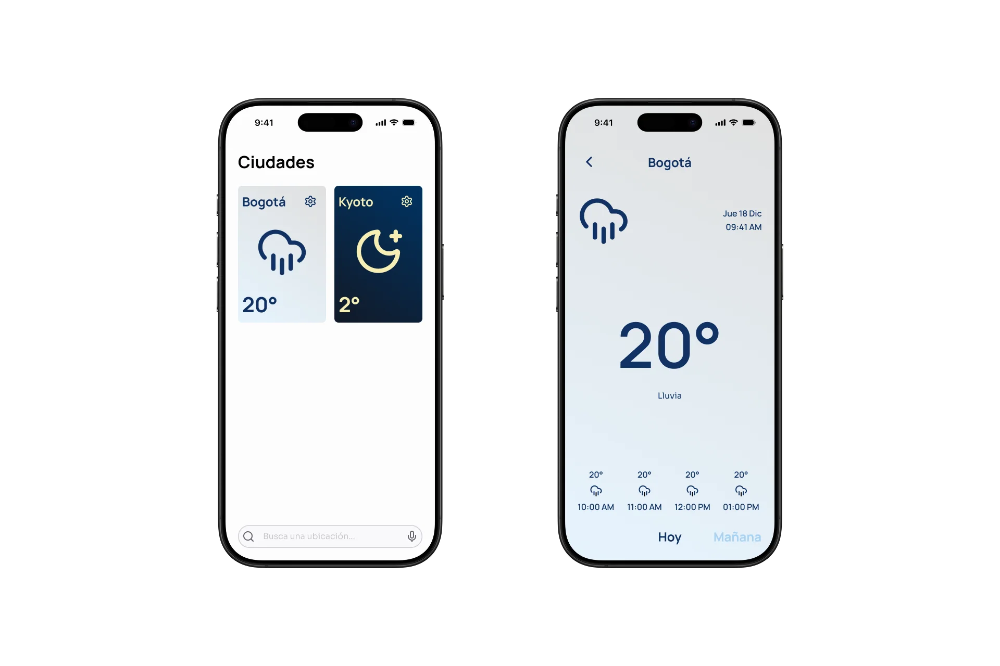

# Contexto

Las aplicaciones del clima son herramientas esenciales para planificar el día a día, pero las mejores opciones suelen ser de pago o estar limitadas a ciertos dispositivos. Las alternativas gratuitas y de código abierto, aunque accesibles, no ofrecen la misma calidad ni experiencia de uso.

Este proyecto nace para cubrir ese vacío: una aplicación del clima abierta, gratuita y disponible en cualquier plataforma, sin sacrificar la calidad ni la usabilidad.

---

# Investigación

Los usuarios priorizan la precisión y fiabilidad de los datos meteorológicos por encima de cualquier otro factor. Sin embargo, también valoran interfaces claras, fáciles de usar y con una identidad visual reconocible. La combinación de estos atributos es lo que distingue a las aplicaciones más utilizadas.

---

# Problema

Los usuarios necesitan una alternativa fiable para consultar el clima desde cualquier dispositivo. Las opciones existentes no siempre están disponibles en todas las plataformas o no ofrecen la experiencia de usuario que se espera hoy en día.

---

# Diseño

Se optó por una estética minimalista que elimina la fricción visual y permite identificar la información relevante de forma inmediata.
El contenido se estructura en dos pantallas:

- Ciudades — búsqueda y gestión de ciudades guardadas.
- Detalle — información meteorológica completa de la ciudad seleccionada.

---

# Desarrollo

La aplicación se esta implementando como una web app con [React](https://react.dev), apoyada en [Vite](https://vite.dev), [Zod](https://zod.dev), [React Router](https://reactrouter.com/home), [React Query](https://tanstack.com/query/latest) y [Zustand](https://zustand-demo.pmnd.rs). Estas herramientas representan el estándar actual del ecosistema React y permitieron construir una base sólida y escalable.

---

# Conclusiones

Es posible construir una aplicación del clima de calidad, abierta y gratuita, sin sacrificar experiencia de usuario. Como próximos pasos, se planea llevar la aplicación a plataformas nativas, tanto móvil como escritorio.
